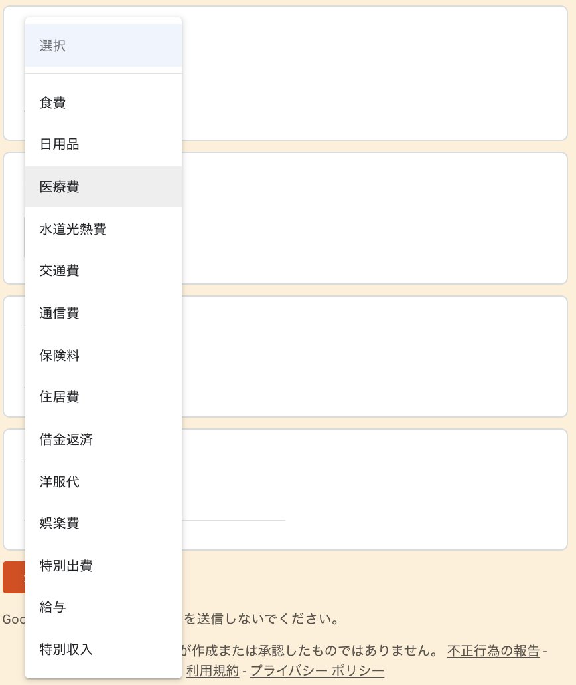

# 自分的最強家計簿

Googleフォーム、Googleスプレッドシート、LINEで管理する自分的最強家計簿ソフトです

LINE BOTに科目ごと話しかけると現在の状態（本日支出額、１ヶ月合計、１日平均、１週間平均、今月予測）とグラフのURLを教えてくれます

# 環境構築

## Googleフォームを作成する

画像のような感じでGoogleフォームを作成します

科目は画像のようなリストで作ると良いでしょう

## Googleスプレッドシートを作成する

### Googleフォームの回答結果を受け取るシートを作成する

Googleフォームの回答結果を書き出すGoogleスプレッドシートを作成します  
Googleフォーム作成画面の回答内のGoogleスプレッドシートのアイコンをクリックすることで作成することができます

作成すると自動的にGoogleスプレッドシートが表示されます  
Sheet名を `フォームの回答` に変更しておいてください

### Googleフォームの回答結果を補正するシートを作成する

新しくシートを作成しシート名は `家計簿補正` にしてください  
そのシートには下記のように値をセットしておいてください

|   |           A           |           B           |           C           |           D           |           E           |           F           |     G     |
|:-:|:---------------------:|:---------------------:|:---------------------:|:---------------------:|:---------------------:|:---------------------:|:---------:|
| 1 | ='フォームの回答'!$A1 | ='フォームの回答'!$B1 | ='フォームの回答'!$C1 | ='フォームの回答'!$D1 | ='フォームの回答'!$E1 | ='フォームの回答'!$F1 | 日付補正  |

下記のようになっていればOKです

### 家計簿のスクリプトをGoogleスプレッドシートに反映させる

下記のファイルをスクリプトエディタにて追加してください

| ファイル名                                                                                 | 説明                                       |
|:-------------------------------------------------------------------------------------------|:-------------------------------------------|
| [Bot.gs](https://github.com/dodonki1223/household-account-book/blob/master/Bot.gs)         | LINEにメッセージを送る機能                 |
| [Chart.gs](https://github.com/dodonki1223/household-account-book/blob/master/Chart.gs)     | グラフ機能を提供する                       |
| [Config.gs](https://github.com/dodonki1223/household-account-book/blob/master/Config.gs)   | 家計簿の設定ファイル                       |
| [Message.gs](https://github.com/dodonki1223/household-account-book/blob/master/Message.gs) | メッセージを作成する機能                   |
| [Open.gs](https://github.com/dodonki1223/household-account-book/blob/master/Open.gs)       | 最新状態を家計簿補正シートに反映させる機能 |
| [Sheet.gs](https://github.com/dodonki1223/household-account-book/blob/master/Sheet.gs)     | シートからデータを取得する機能             |

### Googleフォームを使って回答する

作成したGoogleフォームを使って回答してみます  
回答結果がフォームの回答シートに追加されていることを確認しましょう

### 家計簿補正シートに回答結果を反映させる

追加機能メニューの `フォームの回答データをコピー` をクリックしてください

無事、回答データがコピーされました

`G2` の値を下記のように変更しておいてください  

変更前

|     | G         |
|:---:|:---------:|
|  1  | 日付補正  |
|  2  | 日付補正  |

変更後

|     | G                                       |
|:---:|:---------------------------------------:|
|  1  | 日付補正                                |
|  2  | =IF(C2="","",DATE(YEAR(C2),MONTH(C2),1) |

`=IF(C2="","",DATE(YEAR(C2),MONTH(C2),1)`これは入力日を見て◯年◯月なのかを判断するためのものなります  
月単位で結果を出したい時のための情報になります

これで家計簿ファイルを開くたび・LINEで話しかけるたびに家計簿補正シートが更新されるようになります  
なぜかAndroidでGoogleスプレッドシートを開くと`onOpen`関数が実行されないようです:thinking:
