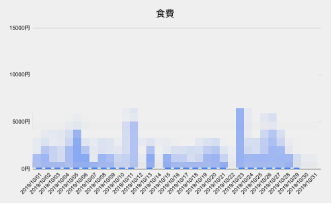
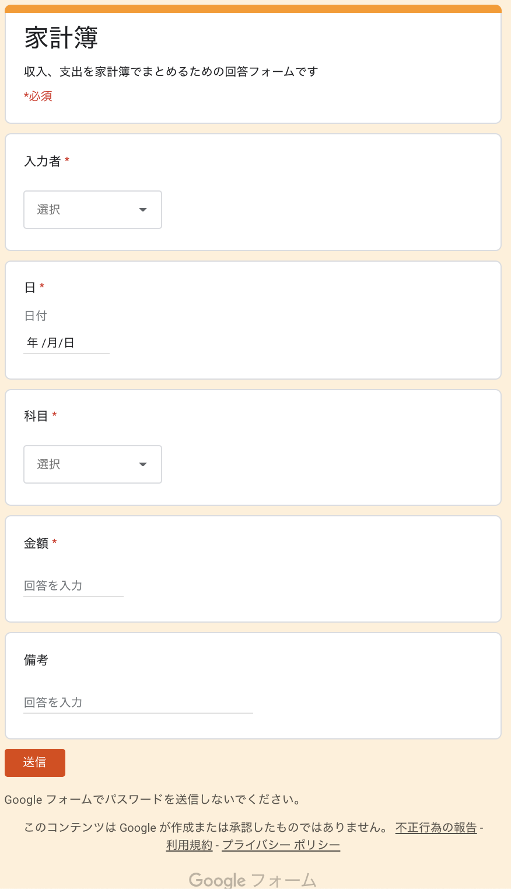
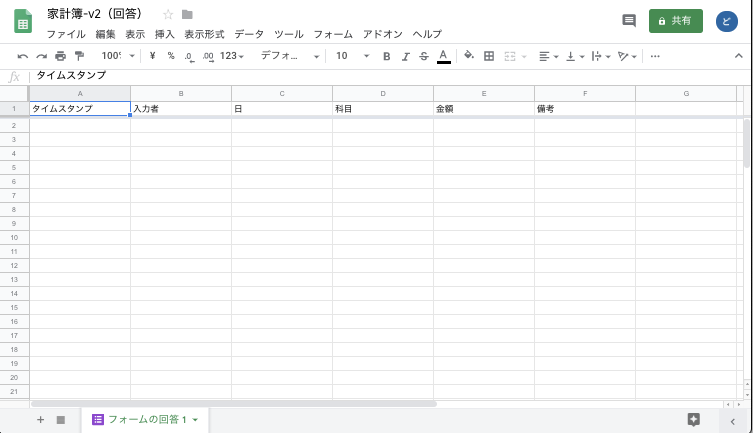
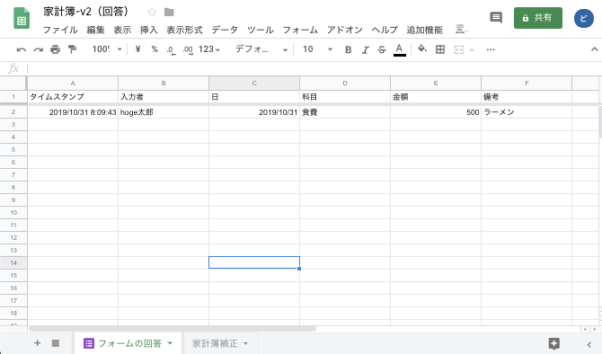
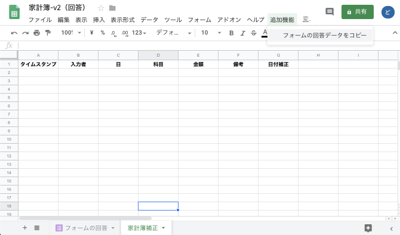
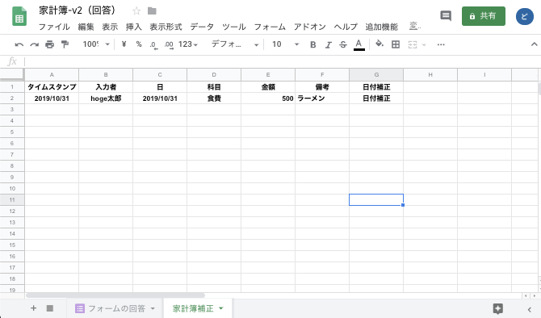

# 自分的最強家計簿

Googleフォーム、Googleスプレッドシート、LINEで管理する自分的最強家計簿ソフトです

LINE BOTに科目ごと話しかけると現在の状態（本日支出額、１ヶ月合計、１日平均、１週間平均、今月予測）とグラフのURLを教えてくれます

# 環境構築

## Googleフォームを作成する

画像のような感じでGoogleフォームを作成します

科目は下記のようなリストで作ると良いでしょう  
特に決まりは無いので好きに作ってもらってよいです。あくまでこれは一例です

- 食費
- 日用品
- 医療費
- 水道光熱費
- 交通費
- 通信費
- 保険料
- 住居費
- 交際費
- 洋服代
- 娯楽費
- 雑費

## Googleスプレッドシートを作成する

### Googleフォームの回答結果を受け取るシートを作成する

Googleフォームの回答結果を書き出すGoogleスプレッドシートを作成します  
Googleフォーム作成画面の回答内のGoogleスプレッドシートのアイコンをクリックすることで作成することができます

作成すると自動的にGoogleスプレッドシートが表示されます  
Sheet名を `フォームの回答` に変更しておいてください

### Googleフォームの回答結果を補正するシートを作成する

新しくシートを作成しシート名は `家計簿補正` にしてください  
そのシートには下記のように値をセットしておいてください

|   |           A           |           B           |           C           |           D           |           E           |           F           |     G     |
|:-:|:---------------------:|:---------------------:|:---------------------:|:---------------------:|:---------------------:|:---------------------:|:---------:|
| 1 | ='フォームの回答'!$A1 | ='フォームの回答'!$B1 | ='フォームの回答'!$C1 | ='フォームの回答'!$D1 | ='フォームの回答'!$E1 | ='フォームの回答'!$F1 | 日付補正  |

下記のようになっていればOKです

### 家計簿のスクリプトをGoogleスプレッドシートに反映させる

下記のファイルをスクリプトエディタにて追加してください

| ファイル名                                                                                 | 説明                                       |
|:-------------------------------------------------------------------------------------------|:-------------------------------------------|
| [Bot.gs](https://github.com/dodonki1223/household-account-book/blob/master/Bot.gs)         | LINEにメッセージを送る機能                 |
| [Chart.gs](https://github.com/dodonki1223/household-account-book/blob/master/Chart.gs)     | グラフ機能を提供する                       |
| [Config.gs](https://github.com/dodonki1223/household-account-book/blob/master/Config.gs)   | 家計簿の設定ファイル                       |
| [Message.gs](https://github.com/dodonki1223/household-account-book/blob/master/Message.gs) | メッセージを作成する機能                   |
| [Open.gs](https://github.com/dodonki1223/household-account-book/blob/master/Open.gs)       | 最新状態を家計簿補正シートに反映させる機能 |
| [Sheet.gs](https://github.com/dodonki1223/household-account-book/blob/master/Sheet.gs)     | シートからデータを取得する機能             |

### Googleフォームを使って回答する

作成したGoogleフォームを使って回答してみます  
回答結果がフォームの回答シートに追加されていることを確認しましょう

### 家計簿補正シートに回答結果を反映させる

追加機能メニューの `フォームの回答データをコピー` をクリックしてください

無事、回答データがコピーされました

`G2` の値を下記のように変更しておいてください  

変更前

|     | G         |
|:---:|:---------:|
|  1  | 日付補正  |
|  2  | 日付補正  |

変更後

|     | G                                       |
|:---:|:---------------------------------------:|
|  1  | 日付補正                                |
|  2  | =IF(C2="","",DATE(YEAR(C2),MONTH(C2),1) |

`=IF(C2="","",DATE(YEAR(C2),MONTH(C2),1)`これは入力日を見て◯年◯月なのかを判断するためのものなります  
月単位で結果を出したい時のための情報になります

これで家計簿ファイルを開くたび・LINEで話しかけるたびに家計簿補正シートが更新されるようになります  
なぜかAndroidでGoogleスプレッドシートを開くと`onOpen`関数が実行されないようです:thinking:

### 今月出費シートを作成する

新しくシートを作成しシート名は `今月出費` にしてください
そのシートには下記のようにセットしておいてください

|     | A                                                                    | B                | C                                                                                                                | ……  |   P                          | ……  | R     | S                                                        |
|:---:|:--------------------------------------------------------------------:|:----------------:|:----------------------------------------------------------------------------------------------------------------:|:-----:|:----------------------------:|:-----:|:-----:|:--------------------------------------------------------:|
|  1  | 日付                                                                 | 曜日             | 食費                                                                                                             | ……  | 合計                         | ……  | 設定  |                                                          |
|  2  | =IF(DAY(DATE($S$2,$S$3,ROW()-1))=ROW()-1,DATE($S$2,$S$3,ROW()-1),"") | =TEXT(A2,"dddd") | =IF($A2="","",SUMIFS('家計簿補正'!$E$2:$E$30992,'家計簿補正'!$C$2:$C$30992,$A2,'家計簿補正'!$D$2:$D$30992,C$1))  | ……  | =IF($A2="","",SUM(C2:O2))    | ……  | 年    | =YEAR(TODAY())                                           |
|  3  | =IF(DAY(DATE($S$2,$S$3,ROW()-1))=ROW()-1,DATE($S$2,$S$3,ROW()-1),"") | =TEXT(A3,"dddd") | =IF($A2="","",SUMIFS('家計簿補正'!$E$2:$E$30992,'家計簿補正'!$C$2:$C$30992,$A3,'家計簿補正'!$D$2:$D$30992,C$1))  | ……  | =IF($A3="","",SUM(C3:O3))    | ……  | 月    | =MONTH(TODAY())                                          |
|  4  | =IF(DAY(DATE($S$2,$S$3,ROW()-1))=ROW()-1,DATE($S$2,$S$3,ROW()-1),"") | =TEXT(A4,"dddd") | =IF($A2="","",SUMIFS('家計簿補正'!$E$2:$E$30992,'家計簿補正'!$C$2:$C$30992,$A4,'家計簿補正'!$D$2:$D$30992,C$1))  | ……  | =IF($A4="","",SUM(C4:O4))    | ……  | 日    | =IF(S3=MONTH(TODAY()),DAY(TODAY()),DAY(DATE(S2,S3+1,0))) |
| ……|  ……                                                                | ……             | ……                                                                                                             | ……  | ……                         | ……  |       |                                                          |
| 33  | =IF(DAY(DATE($S$2,$S$3,ROW()-1))=ROW()-1,DATE($S$2,$S$3,ROW()-1),"") | 合計             | =SUM(C1:C32)                                                                                                     | ……  | =SUM(C1:C32)                 | ……  |       |                                                          |
| 34  | =IF(DAY(DATE($S$2,$S$3,ROW()-1))=ROW()-1,DATE($S$2,$S$3,ROW()-1),"") | １日平均         | =SUM(C2:C32)/$S$4                                                                                                | ……  | =SUM(C2:C32)/$S$4            | ……  |       |                                                          |
| 35  | =IF(DAY(DATE($S$2,$S$3,ROW()-1))=ROW()-1,DATE($S$2,$S$3,ROW()-1),"") | １週間平均       | =C34*7                                                                                                           | ……  | =C34*7                       | ……  |       |                                                          |
| 36  | =IF(DAY(DATE($S$2,$S$3,ROW()-1))=ROW()-1,DATE($S$2,$S$3,ROW()-1),"") | 今月料金予測     | =C34*DAY(EOMONTH(TODAY(),0))                                                                                     | ……  | =C34*DAY(EOMONTH(TODAY(),0)) | ……  |       |                                                          |

下記の画像のようになっていればOKです

