# サーバーレスで作成する自分だけの最強家計簿

Googleフォーム、Googleスプレッドシート、LINE BOTで管理するサーバーレス家計簿です

  

Icons make by [Freepik](https://www.flaticon.com/authors/freepik) from [www.flaticon.com](https://www.flaticon.com/)

# 概要

## Googleフォーム

Googleフォームは家計簿にデータを登録するために使用します  
入力したデータはGoogleスプレッドシートへと格納されていきます

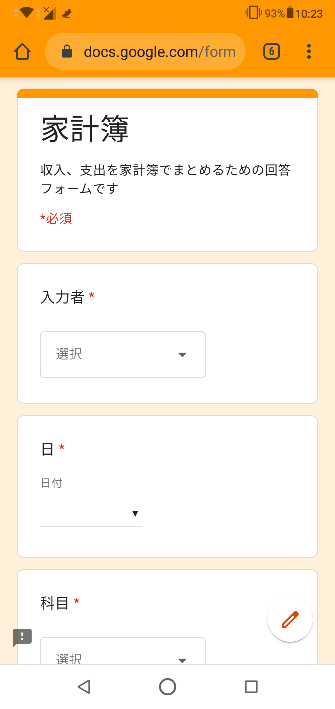

## Googleスプレッドシート

Googleスプレッドシートではいくつかのシートがあります

### フォームの回答

`フォームの回答` シートではGoogleフォームから入力されたデータを格納します

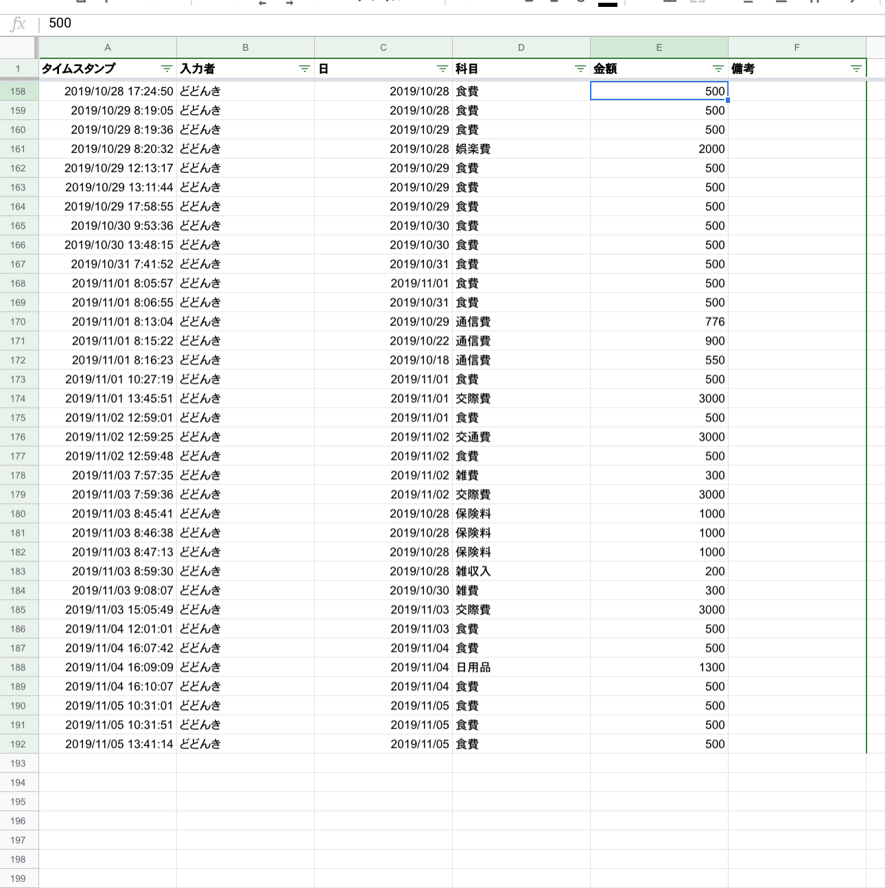

### 家計簿補正

`家計簿補正` シートは `フォームの回答` シートのデータを補正するためのシートです  
日の入力データを元にどの月に入力されたかを判断しています  
日付補正列が追加されていてそこで判断をしています

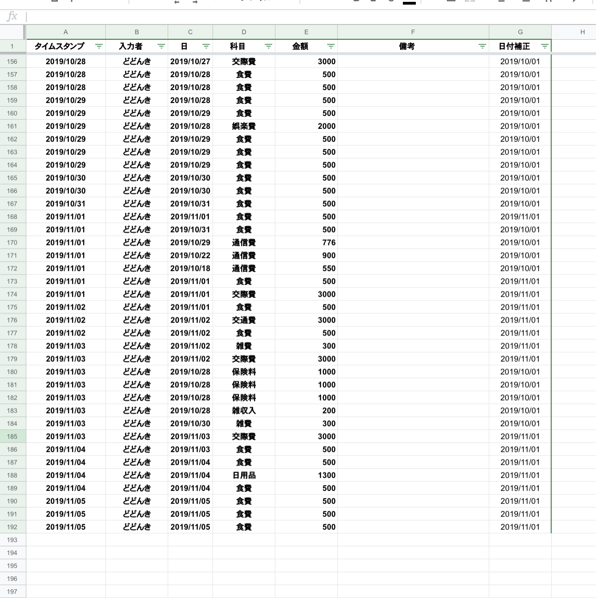

### 今月

`今月` シートは `家計簿補正` シートを元に今月の支出を科目ごとまとめたシートになります

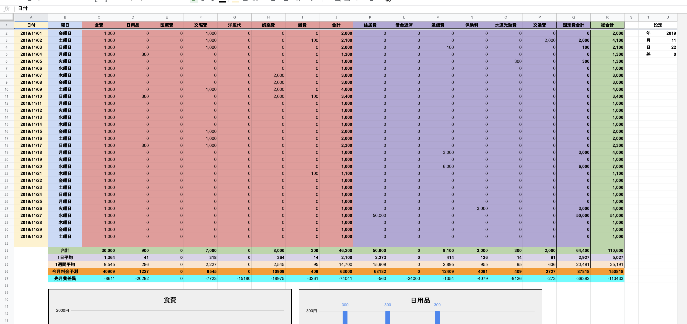

### 先月

`先月` シートは `家計簿補正` シートを元に先月の支出を科目ごとまとめたシートになります  
`今月` シートとの違いは `今月料金予測` 、`先月費差異` の項目がない、グラフが無いになります。ほんとんど`今月` シートと同じです

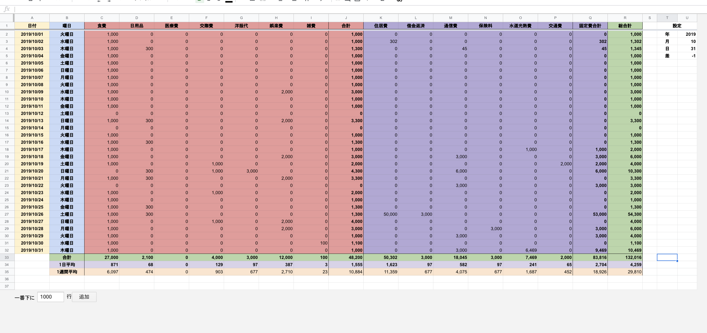

### 月集計

`月集計` シートは `家計簿補正` シートを元に月ごとの集計結果を算出しています

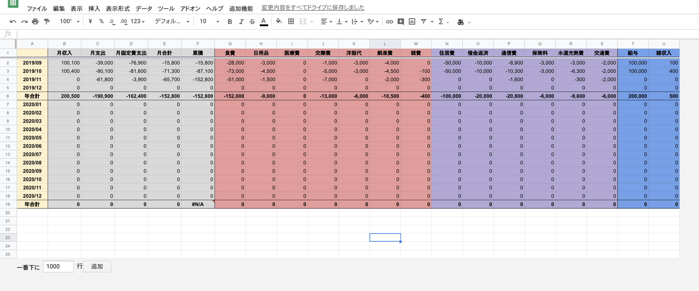

### 設定

`設定` シートはLINE BOTで入力テンプレートを取得する際に使用するシートとなります  
詳しくはLINE BOTの方で説明します

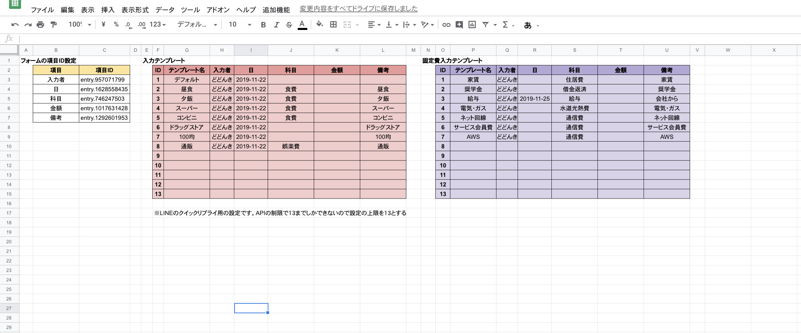

## LINE BOT

LINE BOT画面の下部のメニューを押すことによりいろいろな機能を使用することができます  
表示される内容についてはGoogleスプレッドシートの `今月` シートの内容を通知するようになっています

### 科目毎の結果

上の段の左の `科目毎の結果` をクリックすると科目選択のボタンメニュー上に表示されます  
科目のボタンをクリックするとその科目の今月の結果を確認することができます


画像では食費の結果を確認している所です


グラフの設定をしている場合はリンクが表示されクリックすると下記のように表示されます

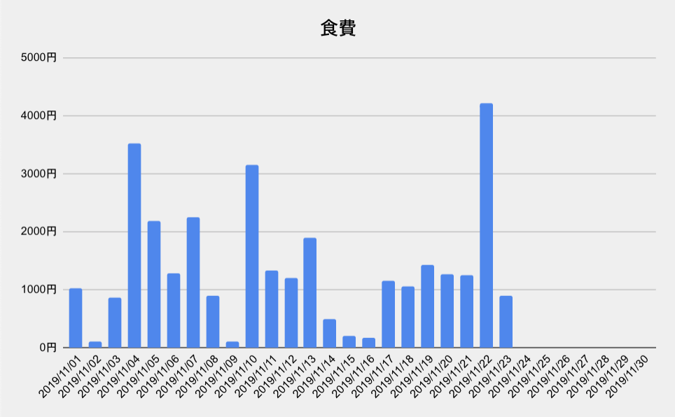

### 今月の支出状況

上の段の真ん中の `今月の支出状況` をクリックすると今月の使用状況が表示されます


### 家計簿へ

上の段の右の `家計簿へ` をクリックすると `今月` シートへのリンクが表示されます


### 入力

下の段の左の `入力` をクリックすると入力用のテンプレートが表示されます  
このテンプレートの一覧はGoogleスプレッドシートの `設定` シートに設定されている `入力テンプレート` から表示されます


入力テンプレート例

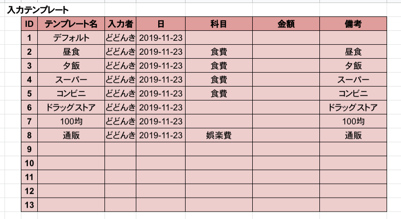

入力テンプレート名をクリックするとGoogleフォームへのURLが表示されます  

テンプレート名の `昼食` を選択した場合は入力者が `どどんき` 、日が `2019-11-23` 、科目が `食費` 、備考が `昼食` で入力された状態のGoogleフォームへのURLが表示されます


### 固定費入力

下の段の真ん中の `固定費入力` をクリックすると固定費入力用のテンプレートが表示されます  
このテンプレートの一覧はGoogleスプレッドシートの `設定` シートに設定されている `固定費入力テンプレート` から表示されます


入力テンプレート例

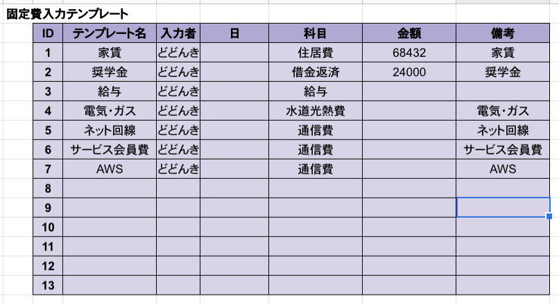

入力テンプレート名をクリックするとGoogleフォームへのURLが表示されます 
基本的に `入力` メニューの機能と一緒で対象が固定費になっているだけです

### ヘルプ

下の段の右の `ヘルプ` をクリックするとこのLINE BOTの使い方が表示されます  
メニューを使わず話しかける時はヘルプに書かれている通りにするとLINE BOTが答えてくれます


# 環境構築

## Googleフォームを作成する

画像のような感じでGoogleフォームを作成します

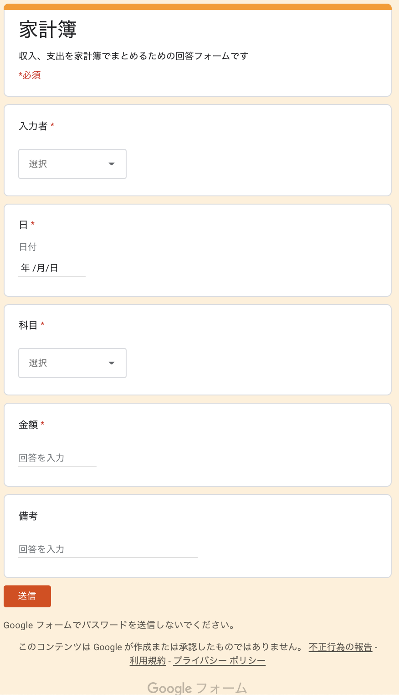

### 入力者のリストを設定

夫婦などで管理する場合に入力者を設定するとよいでしょう  
独り身の自分は自分の名前だけ設定しています

### 科目のリストを設定

科目は下記のようなリストで作ると良いでしょう  
特に決まりは無いので好きに作ってもらってよいです  
※変更する場合は一部プログラムを修正する必要があります

- 通常科目
  - 食費
  - 日用品
  - 医療費
  - 交際費
  - 洋服代
  - 娯楽費
  - 雑費
- 固定費
  - 住居費
  - 借金返済
  - 通信費
  - 保険料
  - 水道光熱費
  - 交通費
- 収入科目
  - 給与
  - 雑収入

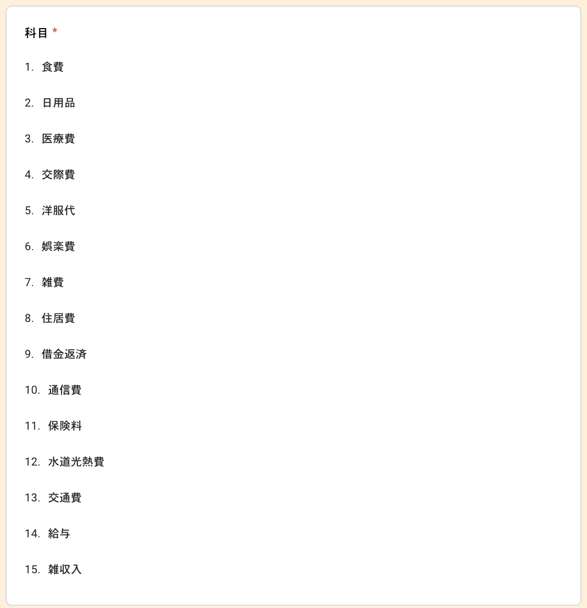

## Googleスプレッドシートを作成する

Googleスプレッドシート内に作成するシートは下記の通りです

1. フォームの回答
2. 家計簿補正
3. 今月
4. 先月
5. 月集計
6. 設定

### フォームの回答シートを作成

Googleフォームの回答結果を書き出すGoogleスプレッドシートを作成します  
Googleフォーム作成画面の回答内のGoogleスプレッドシートのアイコンをクリックすることで作成することができます

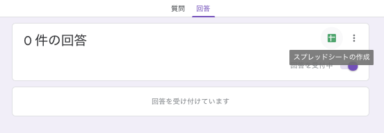

作成すると自動的にGoogleスプレッドシートが表示されます  
Sheet名を `フォームの回答` に変更しておいてください  


この段階でGoogleスプレッドシートも自動で作成されます

### 家計簿補正シートを作成

新しくシートを作成しシート名は `家計簿補正` にしてください  
そのシートには下記のように値をセットしておいてください

|   |           A           |           B           |           C           |           D           |           E           |           F           |     G                                                            |
|:-:|:---------------------:|:---------------------:|:---------------------:|:---------------------:|:---------------------:|:---------------------:|:----------------------------------------------------------------:|
| 1 | ='フォームの回答'!$A1 | ='フォームの回答'!$B1 | ='フォームの回答'!$C1 | ='フォームの回答'!$D1 | ='フォームの回答'!$E1 | ='フォームの回答'!$F1 | =IF(ROW()=1,"日付補正",IF(C1="","",DATE(YEAR(C1),MONTH(C1),1)))  |

下記のようになっていればOKです

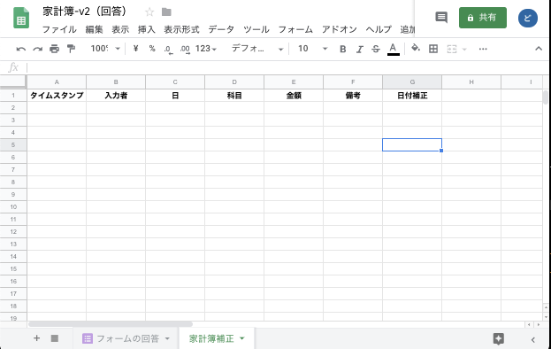

### 家計簿のスクリプトをGoogleスプレッドシートに反映させる

下記のファイルをスクリプトエディタにて追加してください  
`_Config.gs` ファイルは `Config.gs` にリネームしてください

| ファイル名                                                                                           | 説明                                           |
|:-----------------------------------------------------------------------------------------------------|:-----------------------------------------------|
| [Bot.gs](https://github.com/dodonki1223/household-account-book/blob/master/Bot.gs)                   | LINEにメッセージを送る機能                     |
| [Chart.gs](https://github.com/dodonki1223/household-account-book/blob/master/Chart.gs)               | グラフ機能を提供する                           |
| [Message.gs](https://github.com/dodonki1223/household-account-book/blob/master/Message.gs)           | メッセージを作成する機能                       |
| [Open.gs](https://github.com/dodonki1223/household-account-book/blob/master/Open.gs)                 | 最新状態を家計簿補正シートに反映させる機能     |
| [SettingSheet.gs](https://github.com/dodonki1223/household-account-book/blob/master/SettingSheet.gs) | LINE BOT用の設定シート                         |
| [Sheet.gs](https://github.com/dodonki1223/household-account-book/blob/master/Sheet.gs)               | シートからデータを取得する機能                 |
| [Tool.gs](https://github.com/dodonki1223/household-account-book/blob/master/Tool.gs)                 | 家計簿で使用する汎用的なメソッドをまとめたもの |
| [_Config.gs](https://github.com/dodonki1223/household-account-book/blob/master/Config.gs)            | 家計簿の設定ファイル                           |

### GoogleフォームとGoogleスプレッドシートが連携されているか確認する

作成したGoogleフォームを使って回答してみます  
回答結果がフォームの回答シートに追加されていることを確認しましょう

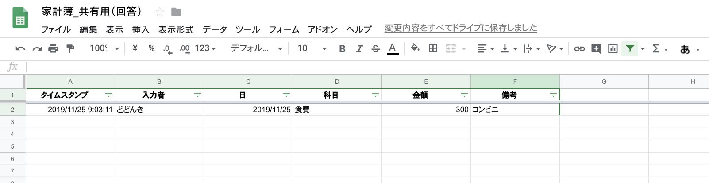

家計簿補正シートに回答結果を反映させるため  
追加機能メニューの `フォームの回答データをコピー` をクリックしてください

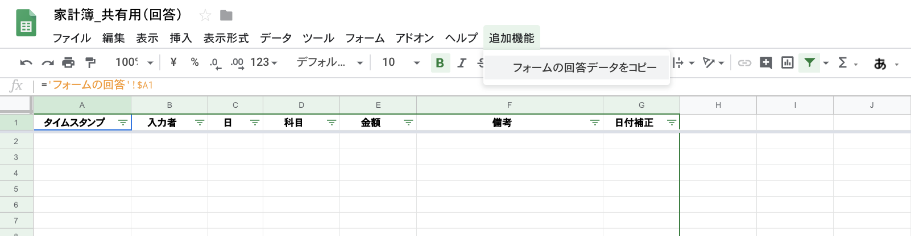

`承認が必要` というウィンドウが出た時は 
- `続行` ボタンをクリック
- 対象のアカウントを選択
- このアプリは確認されていません画面で `詳細` をクリック `一番下のリンク` をクリック
- `許可` ボタンをクリック

無事、回答データがコピーされました

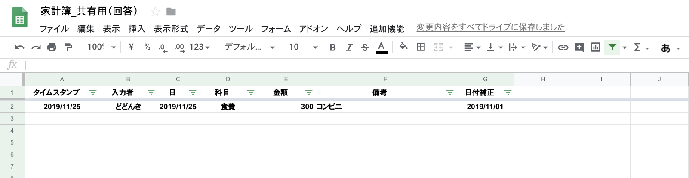

これで家計簿ファイルを開くたび、LINE BOTを実行するたびに家計簿補正シートが更新されるようになります  
なぜかAndroidでGoogleスプレッドシートを開くと`onOpen`関数が実行されないようです:thinking:

## 今月シートを作成

新しくシートを作成しシート名は `今月` にしてください  

### T、U列に値をセット

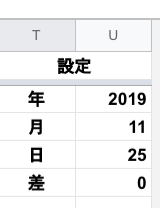

下記のように値をセットし上記画像のようになればOKです

<table>
  <tr>
    <td></td>
    <td align="center">T</td>
    <td align="center">U</td>
  </tr>
  <tr>
    <td>1</td>
    <td colspan="2" align="center">設定</td>
  </tr>
  <tr>
    <td>2</td>
    <td>年</td>
    <td>=YEAR(EDATE(TODAY(), U5))</td>
  </tr>
  <tr>
    <td>3</td>
    <td>月</td>
    <td>=MONTH(EDATE(TODAY(), U5))</td>
  </tr>
  <tr>
    <td>4</td>
    <td>日</td>
    <td>=IF(U3=MONTH(TODAY()),DAY(TODAY()),DAY(DATE(U2,U3+1,0)))</td>
  </tr>
  <tr>
    <td>5</td>
    <td>差</td>
    <td>0</td>
  </tr>
</table>

### A〜R列に値をセット

#### A列（日付列）

A列には日付けを求める関数をセットします  
月によっては31日までないものもあるのでその対応で日付けを取得できなかったら空になるようになっています

```
=IF(DAY(DATE($S$2,$S$3,ROW()-1))=ROW()-1,DATE($S$2,$S$3,ROW()-1),"")
```

#### B列（曜日列）

B列には日付けから曜日を求める関数をセットします  
例としては下記のような値です

```
=TEXT(A2,"dddd")
```

#### C〜I列（通常科目列）、K〜P列（固定費科目列）

C〜I列、K〜P列には家計簿補正シートから日付けごと、科目ごとの集計を計算する関数をセットします  
例としては下記のような値です

```
=IF(`$A2`="","",SUMIFS('家計簿補正'`!$E$2`:`$E$30992`,'家計簿補正'`!$C$2:$C$30992`,`$A2`,'家計簿補正'`!$D$2:$D$30992`,`C$1`))
```

#### J列（通常科目の合計列）

J列には通常科目の合計値を求める関数をセットします  
例としては下記のような値です

```
=IF($A2="","",SUM(C2:I2))
```

#### Q列（固定費科目の合計列）

Q列には固定費科目の合計値を求める関数をセットします 
例としては下記のような値です

```
=IF($A2="","",SUM(K2:P2))
```

#### R列（総合計列）

R列には通常科目の合計と固定費科目の合計値をセットしてください  
例としては下記のような値です

```
=J2+Q2
```

#### 合計行

合計行には１ヶ月の合計値を求める関数をセットしてください  
例としては下記のような値です

```
=SUM(C1:C32)
```

#### １日平均行

１日平均行には１日に使用している平均値を求める関数をセットしてください  
`$U$4` には月初から現在までの日数が求められています  
例としては下記のような値です

```
=SUM(C2:C32)/$U$4 
```

#### １週間平均行

１週間平均行には１週間で使用している平均値を求める関数をセットしてください  
実際には `１日平均 x 7` をしているだけです
例としては下記のような値です

```
=C34 * 7
```

#### 今月料金予測行

今月料金予測行には今月の合計値の予測値を求める関数をセットしてください  
実際には `１日平均 x 月数` をしているだけです
例としては下記のような値です

```
=C34*DAY(EOMONTH(TODAY(),0))
```

#### 先月費差異行

先月費差異行には先月の合計値と今月料金予測の値を差し引きし先月に比べて今月がどうかを求める関数をセットしてください  
この状態だと `先月` シートはまだ作成していないので正しい値はでません  
例としては下記のような値です

```
=C36-'先月'!C33
```

#### 最終的な値

下記のような表と同じ値になっていればOKです

|     | A                                                                            | B                | C                                                                                                                             | …… | J                              | K                                                                                                                             | …… | Q                              | R                              |
|:---:|:----------------------------------------------------------------------------:|:----------------:|:-----------------------------------------------------------------------------------------------------------------------------:|:----:|:------------------------------:|:-----------------------------------------------------------------------------------------------------------------------------:|:----:|:------------------------------:|:------------------------------:|
|  1  | 日付                                                                         | 曜日             | 食費                                                                                                                          | …… | 合計                           | 住居費                                                                                                                        | …… | 固定費合計                     | 総合計                         |
|  2  | =IF(DAY(DATE(`$S$2`,`$S$3`,ROW()-1))=ROW()-1,DATE(`$S$2`,`$S$3`,ROW()-1),"") | =TEXT(A2,"dddd") | =IF(`$A2`="","",SUMIFS('家計簿補正'`!$E$2`:`$E$30992`,'家計簿補正'`!$C$2:$C$30992`,`$A2`,'家計簿補正'`!$D$2:$D$30992`,`C$1`)) | …… | =IF(`$A2`="","",SUM(`C2:I2`))  | =IF(`$A2`="","",SUMIFS('家計簿補正'`!$E$2`:`$E$30992`,'家計簿補正'`!$C$2:$C$30992`,`$A2`,'家計簿補正'`!$D$2:$D$30992`,`K$1`)) | …… | =IF(`$A2`="","",SUM(`K2:P2`))  | =J2+Q2                         |
|  3  | =IF(DAY(DATE(`$S$2`,`$S$3`,ROW()-1))=ROW()-1,DATE(`$S$2`,`$S$3`,ROW()-1),"") | =TEXT(A3,"dddd") | =IF(`$A3`="","",SUMIFS('家計簿補正'`!$E$2`:`$E$30992`,'家計簿補正'`!$C$2:$C$30992`,`$A3`,'家計簿補正'`!$D$2:$D$30992`,`C$1`)) | …… | =IF(`$A3`="","",SUM(`C3:I3`))  | =IF(`$A3`="","",SUMIFS('家計簿補正'`!$E$2`:`$E$30992`,'家計簿補正'`!$C$2:$C$30992`,`$A3`,'家計簿補正'`!$D$2:$D$30992`,`K$1`)) | …… | =IF(`$A3`="","",SUM(`K3:P3`))  | =J3+Q3                         |
|  4  | =IF(DAY(DATE(`$S$2`,`$S$3`,ROW()-1))=ROW()-1,DATE(`$S$2`,`$S$3`,ROW()-1),"") | =TEXT(A4,"dddd") | =IF(`$A4`="","",SUMIFS('家計簿補正'`!$E$2`:`$E$30992`,'家計簿補正'`!$C$2:$C$30992`,`$A4`,'家計簿補正'`!$D$2:$D$30992`,`C$1`)) | …… | =IF(`$A4`="","",SUM(`C4:I4`))  | =IF(`$A4`="","",SUMIFS('家計簿補正'`!$E$2`:`$E$30992`,'家計簿補正'`!$C$2:$C$30992`,`$A4`,'家計簿補正'`!$D$2:$D$30992`,`K$1`)) | …… | =IF(`$A4`="","",SUM(`K4:P4`))  | =J4+Q4                         |
| ……|  ……                                                                        | ……             | ……                                                                                                                          | …… | ……                           | ……                                                                                                                          | …… | ……                           | ……                           |
| 33  |                                                                              | 合計             | =SUM(C1:C32)                                                                                                                  | …… | =SUM(J1:J32)                   | =SUM(K1:K32)                                                                                                                  | …… | =SUM(Q1:Q32)                   | =SUM(R1:R32)                   |
| 34  |                                                                              | １日平均         | =SUM(C2:C32)/$U$4                                                                                                             | …… | =SUM(J2:J32)/$U$4              | =SUM(K2:K32)/$U$4                                                                                                             | …… | =SUM(Q2:Q32)/$U$4              | =SUM(R2:R32)/$U$4              |
| 35  |                                                                              | １週間平均       | =C34 * 7                                                                                                                      | …… | =J34 * 7                       | =K34 * 7                                                                                                                      | …… | =Q34 * 7                       | =R34 * 7                       |
| 36  |                                                                              | 今月料金予測     | =C34 * DAY(EOMONTH(TODAY(),0))                                                                                                | …… | =J34 * DAY(EOMONTH(TODAY(),0)) | =K34 * DAY(EOMONTH(TODAY(),0))                                                                                                | …… | =Q34 * DAY(EOMONTH(TODAY(),0)) | =R34 * DAY(EOMONTH(TODAY(),0)) |
| 37  |                                                                              | 先月費差異       | =C36-'先月'!C33                                                                                                               | …… | =J36-'先月'!J33                | =K36-'先月'!K33                                                                                                               | …… | =Q36-'先月'!Q33                | =R36-'先月'!R33                |

画像のような表示になっていればOKです

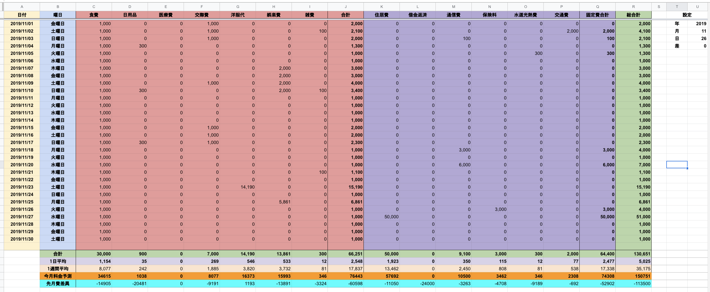

### グラフを追加する

下記のような感じで科目ごとのグラフを追加します  
全部設定する必要はなく、自分が欲しいものだけ追加すると良いでしょう

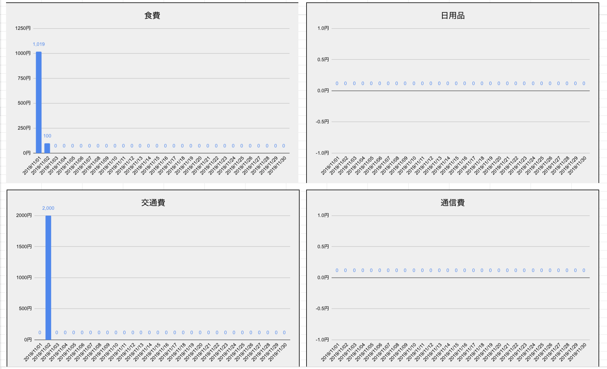

グラフを追加したらURLの公開設定を行います  
グラフの右上をクリックして `グラフを公開` を押しリンクで設定します

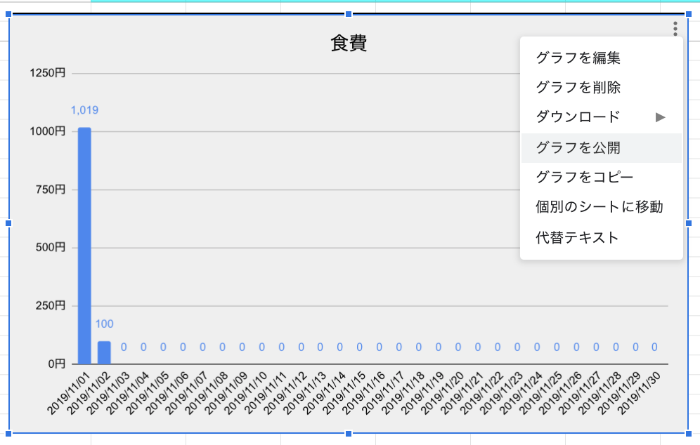


## 一旦、ウェブアプリケーションとして公開する

スクリプトエディタからウェブアプリケーションとして公開します

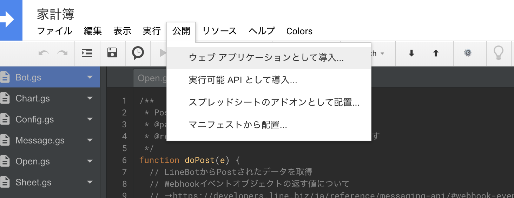

## LINE BOTの作成

LINEのエンジニアの方が書かれている記事を參考にMessaging APIの作成を行って下さい。

- [LINEのBot開発 超入門（前編） ゼロから応答ができるまで - Qiita](https://qiita.com/nkjm/items/38808bbc97d6927837cd)  

LINEのアクセストークンが必要なのでメモしておいて下さい。  
`BOT`の作成は必要ないので作成しなくて大丈夫です。`BOT` 本体はGoogleスプレッドシートになります

`Webhook URL` の接続確認だけしておいてください

## 設定情報をセットする

LINEのアクセストークン、今月出費シートのURL、GoogleフォームのURLを `Config.gs` ファイルに設定します

```javascript
// LineAccessToken         ：LINE developersのメッセージ送受信設定に記載のアクセストークン
// LinePostUrl             ：LINE Messaging APIのURL
// HouseholdAccountBookUrl ：家計簿のURL
// FormUrl                 ：家計簿入力用のURL
var config = {
  LineAccessToken         : 'Lineのアクセストークン',
  LinePostUrl             : 'https://api.line.me/v2/bot/message/reply',
  HouseholdAccountBookUrl : 'Googleスプレッドシートの今月の支出シートURL',
  FormUrl                 : 'GoogleフォームのURL'
};
```

グラフのURLを `Chart.gs` ファイルに設定します

```javascript
// グラフの存在する項目のURLリスト
// Base64で取得する方法もあるがめんどいので今回は固定値で対応する
// https://developers.google.com/apps-script/reference/charts
var ChartList = {
  食費  : '食費グラフURL',
  日用品: '日用品のURL',
  交通費: '交通費のURL',
  通信費: '通信費のURL',
  洋服代: '洋服代のURL',
  娯楽費: '娯楽費のURL'
}
```

再度、ウェブアプリケーションとして公開すれば完成です

# その他

いくつかその他にも機能がありますが、細かい機能についてはソースを読んでください
